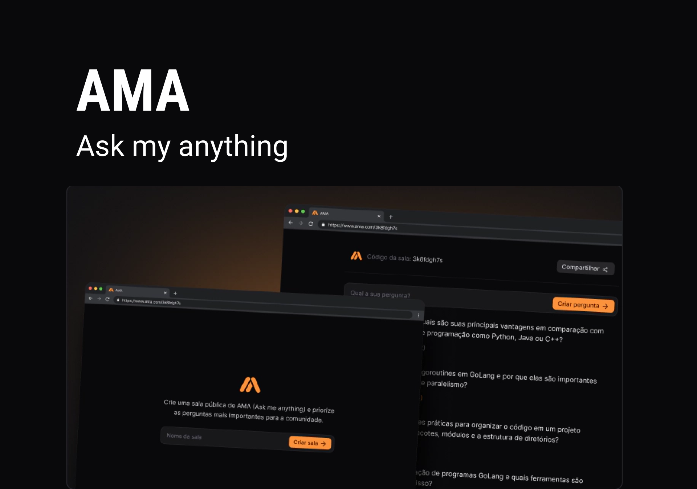

# AMA | Ask My Anything



Este projeto é uma aplicação de perguntas e respostas em tempo real, construída com as seguintes tecnologias:

## Stack utilizada:

- **React** Biblioteca JavaScript para construir interfaces de usuário.
- **Vite** Ferramenta de build rápida e leve para projetos web modernos.
- **Tailwind CSS** Framework de CSS utilitário para estilização.
- **React Query** Gerenciamento de estado assíncrono com cache de dados.
- **Hooks** Funções do React que permitem usar estado e outros recursos sem escrever uma classe.
- **WebSockets** Protocolo para comunicação em tempo real entre o cliente e o servidor.


## Funcionalidades:


- **Criação de salas:** Usuários podem criar e gerenciar salas de perguntas.
- **Envio de perguntas em tempo real:** As perguntas são enviadas e recebidas instantaneamente através de WebSockets.
- **Filtragem e ordenação:** Perguntas podem ser filtradas por relevância, mais recentes ou mais votadas.


## Instalação

Clone este repositório:

```bash
  git clone https://github.com/seu-usuario/seu-repositorio.git
  cd my-project
```
    
Navegue até o diretório do projeto:

```bash
  cd my-project
```

Instale as dependências:

```bash
  npm install
```

Inicie o servidor de desenvolvimento:

```bash
  npm run dev
```
## Contribuindo

Contribuições são sempre bem-vindas!

    1. Faça um fork deste repositório.
    2. Crie uma branch para sua feature ou correção de bug: git checkout -b minha-feature.
    3. Commit suas alterações: git commit -m 'Minha nova feature'.
    4. Faça um push para a branch: git push origin minha-feature.
    5. Abra um Pull Request.

## Licença

Esta aplicação cobre todas as seções essenciais, como funcionalidades, instalação, configuração, tecnologias utilizadas, como contribuir e a licença [MIT](https://choosealicense.com/licenses/mit/).
